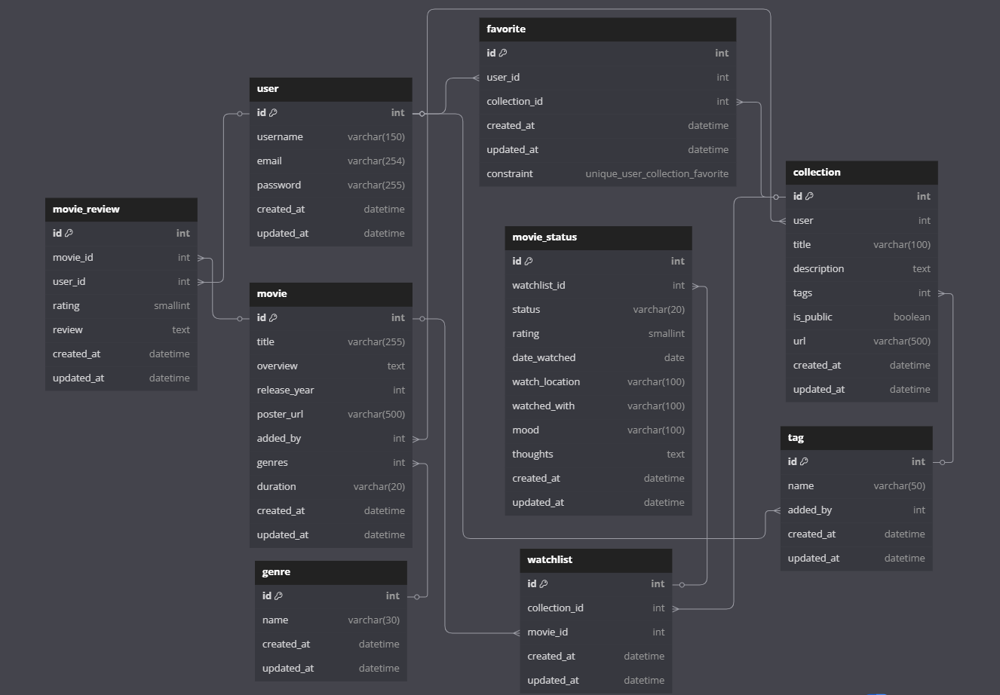

# Movielix

  

## Description

Movielix is a full-stack movie watchlist project that allows users to create, edit, and delete movies and collections, add or remove movies in collections, and favorite both personal and public collections.

Built with Django, Django REST Framework (DRF), PostgreSQL, React, Bootstrap, and JWT authentication.

Developed as the capstone project of the SDA x GA SEB bootcamp.

## Tech Stack

- Django
- Django REST Framework
- PostgreSQL
- JWT Authentication

## FrontEnd Repo Link

[Movielix Frontend](https://github.com/vMohd/movielix-frontend)

## ERD Diagram

## RESTful Routing Table

### Movies

| Purpose                 | Server URL          | Client URL             | HTTP Verb | Description                      |
| ----------------------- | ------------------- | ---------------------- | --------- | -------------------------------- |
| List all movies         | `/movies/`          | `/movies`              | GET       | List all movies                  |
| Create a new movie      | `/movies/`          | `/movies/add`          | POST      | Add a new movie                  |
| View a specific movie   | `/movies/<int:pk>/` | `/movie/:movieId`      | GET       | View details of a specific movie |
| Update a specific movie | `/movies/<int:pk>/` | `/movie/:movieId/edit` | PATCH     | Edit a specific movie            |
| Delete a specific movie | `/movies/<int:pk>/` | `/movie/:movieId/`     | DELETE    | Delete a specific movie          |

---

### Collections & Watchlist

| Purpose                                       | Server URL                                               | Client URL                               | HTTP Verb | Description                                  |
| --------------------------------------------- | -------------------------------------------------------- | ---------------------------------------- | --------- | -------------------------------------------- |
| List all collections                          | `/collections/`                                          | `/collections`                           | GET       | List all user collections                    |
| Create a new collection                       | `/collections/`                                          | `/collections/add`                       | POST      | Create a new collection                      |
| View a specific collection                    | `/collections/<int:pk>/`                                 | `/collection/:collectionId`              | GET       | View details of a specific collection        |
| Update a collection                           | `/collections/<int:pk>/`                                 | `/collection/:collectionId/edit`         | PATCH     | Edit a specific collection                   |
| Delete a collection                           | `/collections/<int:pk>/`                                 | `/collection/:collectionId/`             | DELETE    | Delete a collection                          |
| Get watchlist for a collection                | `/collections/<int:collection_id>/watchlist/`            | `/collection/:collectionId`              | GET       | Get watchlist for a collection               |
| Add a movie to a collection's watchlist       | `/collections/<int:collection_id>/watchlist/`            | `/collection/:collectionId`              | POST      | Add a movie to a collection's watchlist      |
| Remove a movie from a collection's watchlist  | `/collections/<int:collection_id>/movie/<int:movie_id>/` | `/collection/:collectionId`              | DELETE    | Remove a movie from a collection's watchlist |
| view details of a specific movie in wacthlist | `/watchlist/<int:watchlist_id>/movie/<int:movie_id>`     | `/watchlist/:watchlistId/movie/:movieId` | PATCH     | Toggle movie status in watchlist             |

---

### Favorite

| Purpose                             | Server URL                        | Client URL   | HTTP Verb | Description                        |
| ----------------------------------- | --------------------------------- | ------------ | --------- | ---------------------------------- |
| Get all user's favorite collections | `/favorites/`                     | `/favorites` | GET       | List all favorited collections     |
| Add a collection to favorites       | `/favorites/`                     | `/favorites` | POST      | Add a collection to favorites      |
| Remove a collection from favorites  | `/favorites/<int:collection_id>/` | `/favorites` | DELETE    | Remove a collection from favorites |

### User Authentication

| Purpose                   | Server URL        | Client URL  | HTTP Verb | Description                                |
| ------------------------- | ----------------- | ----------- | --------- | ------------------------------------------ |
| Obtain JWT token for user | `/token/`         | /login      | POST      | Obtain a JWT token for user authentication |
| Refresh JWT token         | `/token/refresh/` | N/A         | POST      | Refresh JWT token                          |
| Register a new user       | `/signup/`        | `/register` | POST      | Register a new user                        |

## User Stories

- As a user, I can register and log in.
- As a user, I can create, update, and delete my own collections.
- As a user, I can make a collection public or private.
- As a user, I can add movies to my collections.
- As a user, I can update or delete movies from my collections.
- As a user, I can add notes to movies (date to watch, where to watch, with whom).
- As a user, I can update and delete movie notes.
- As a user, I can mark a movie as watched, add a rating (1-5), and write a review.
- As a user, I can update or delete movie statuses (watched details).
- As a user, I can favorite any public collection.
- As a user, I can browse public collections in the Explore section.
- As a user, I can view full details for movies inside public collections.

---

## Getting Started/Code Installation

To clone the project up and running on your local machine, follow these instructions:

#### 1. Clone the repo:

- `git clone https://github.com/vMohd/movielix-frontend.git`
- `git clone https://github.com/vMohd/movielix-backend.git`

#### 2. Install backend dependencies:

Install Pipenv (if you don’t have it already):

- `pipenv install`

Navigate to the backend directory and install dependencies:

- `cd movielix-backend`
- `pipenv install`

#### 3. Set up database:

Create and activate the virtual environment:

- `pipenv shell`

Make migrations and migrate the database:

- `python manage.py makemigrations`
- `python manage.py migrate`

### 4. Start the Django development server:

- `python manage.py runserver`

#### 5. In a new terminal, navigate to the frontend directory and install dependencies:

- `cd movielix-frontend`
- `npm install`

#### 6. Start the React development server:

- `npm run dev`

## IceBox Features

- Public Collections and Sharing: Allow users to generate public links for their collections and share them with others.

- TMDB Integration: Fetch custom movie from The Movie Database (TMDB) API to added them into the watchlist.

- User Profiles: Add user profiles to display, user information and collections status.

- Search and Filters: Allow users to search movies by genres, release years, ratings, and other filters.

